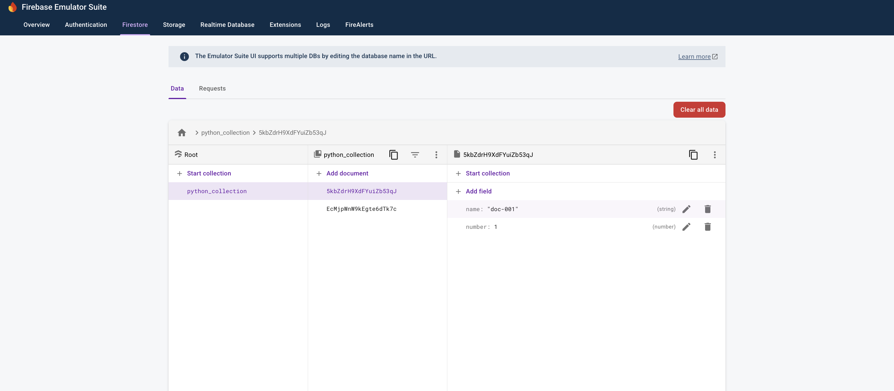
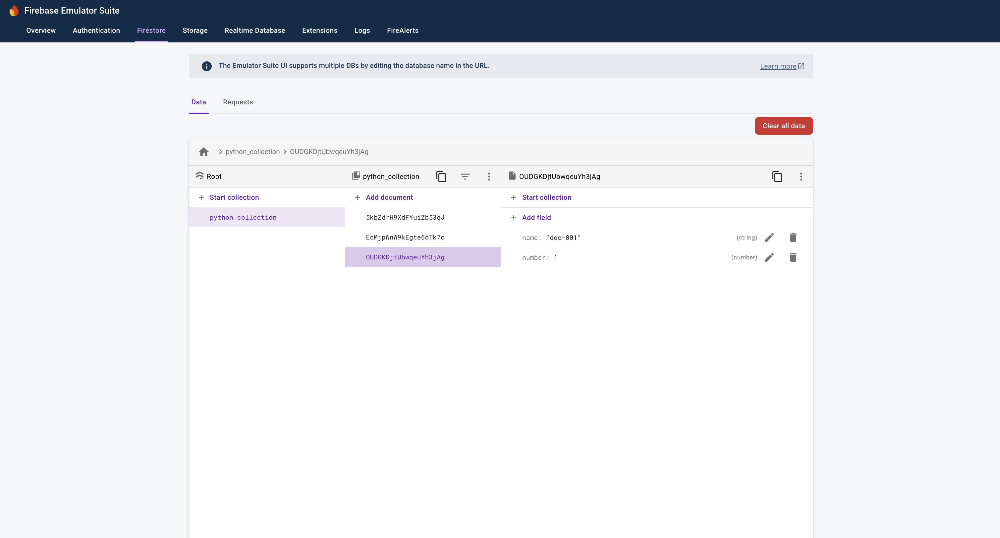
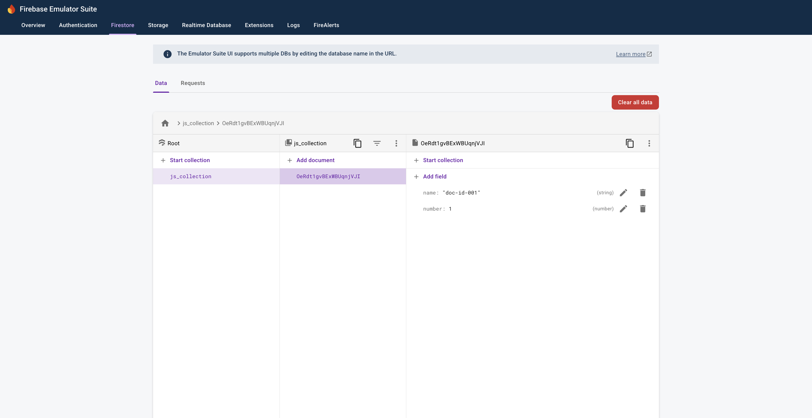

# Repro for issue 8774

## Summary

When emulating Python Functions, the very first invocation of a functions it runs twice. On every succeeding invocation it runs once(expected behavior).
Not reproducible on emulated JS Function.

## Versions

firebase-tools: 14.7.0<br>
python: Python 3.12.4<br>
node: v20.19.1

## Steps to reproduce issue

1. Install dependencies for python functions
   - Run `cd functions`
   - Run `python3.12 -m venv venv`
   - Run `. ./venv/bin/activate`
   - Run `cd ../`
2. Install dependencies for javascript functions

   - Run `cd js-functions`
   - Run `npm i`
   - Run `cd ../`

3. Run `firebase emulators:start --project demo-project`
4. Run `curl http://127.0.0.1:5001/demo-project/us-central1/py_create_docs`
   - 2 docs are created even though code should only create one
     
5. Run `curl http://127.0.0.1:5001/demo-project/us-central1/py_create_docs` again
   - Only 1 doc is created which is the expected behavior
     
6. Run `curl http://127.0.0.1:5001/demo-project/us-central1/py_test`
   - `PRINT_STATEMENT - SHOULD ONLY APPEAR ONCE!!!` is printed twice

```
>   * Serving Flask app 'py_test'
>   * Debug mode: on
>  WARNING: This is a development server. Do not use it in a production deployment. Use a production WSGI server instead.
>   * Running on http://127.0.0.1:8427
>  Press CTRL+C to quit
>   * Restarting with watchdog (fsevents)
>   * Debugger is active!
>   * Debugger PIN: 126-030-938
>  PRINT_STATEMENT - SHOULD ONLY APPEAR ONCE!!!
>  127.0.0.1 - - [19/Jun/2025 16:49:58] "GET /__/health HTTP/1.1" 200 -
i  functions: Beginning execution of "us-central1-py_test"
>  PRINT_STATEMENT - SHOULD ONLY APPEAR ONCE!!!
>  127.0.0.1 - - [19/Jun/2025 16:49:58] "GET / HTTP/1.1" 200 -
i  functions: Finished "us-central1-py_test" in 1.856375ms
```

7. Run `curl http://127.0.0.1:5001/demo-project/us-central1/py_test` again
   - `PRINT_STATEMENT - SHOULD ONLY APPEAR ONCE!!!` is printed once which is the expected behavior

```
i  functions: Beginning execution of "us-central1-py_test"
>  PRINT_STATEMENT - SHOULD ONLY APPEAR ONCE!!!
>  127.0.0.1 - - [19/Jun/2025 16:50:51] "GET / HTTP/1.1" 200 -
i  functions: Finished "us-central1-py_test" in 1.594208ms
```

## Notes

It looks like when emulating Python functions, the first invocation of a function runs it twice. On succeeding invocations, it runs only once(which is expected)

It seems to only occur in Python functions. Not reproducible on JS functions

1. Run `firebase emulators:start --project demo-project`
2. Run `curl http://127.0.0.1:5001/demo-project/us-central1/jsCreateDocs`
   - Only 1 doc is created which is the expected behavior
     
3. Run `curl http://127.0.0.1:5001/demo-project/us-central1/jsTest`
   - `PRINT_STATEMENT - SHOULD ONLY APPEAR ONCE!!!` is printed once

```
i  functions: Beginning execution of "us-central1-jsTest"
>  PRINT_STATEMENT - SHOULD ONLY APPEAR ONCE!!!
i  functions: Finished "us-central1-jsTest" in 3.119584ms
```
